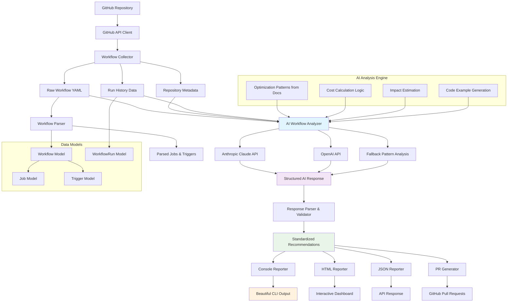

# GHA-Optimizer Architecture

## 🏗️ System Overview



## 🔧 Core Components

### 1. **GitHub API Client** (`collectors/github_client.py`)

**Responsibility**: Direct GitHub API integration with authentication and error handling

```python
class GitHubClient:
    def collect_workflows(self, owner: str, repo: str) -> List[Workflow]
    def collect_run_history(self, owner: str, repo: str, days: int = 30) -> List[WorkflowRun]
    def collect_repository_metadata(self, owner: str, repo: str) -> dict
    def test_connection(self) -> bool
```

**Features**:
- Authenticated API requests with token validation
- Rate limiting and error handling
- Repository metadata collection
- Workflow file content fetching

### 2. **Workflow Collector** (`collectors/workflow_collector.py`)

**Responsibility**: Aggregate and organize all workflow-related data

```python
class WorkflowCollector:
    def collect_workflow_data(self, owner: str, repo: str, token: str, max_history_days: int) -> Dict[str, Any]
    def get_raw_workflows_for_ai(self, owner: str, repo: str, token: str) -> Dict[str, str]
```

**Data Aggregation**:
- Raw YAML workflow content for AI analysis
- Repository statistics and metadata
- Historical run data for impact calculations
- Activity levels and patterns

### 3. **Workflow Parser** (`models/workflow.py`)

**Responsibility**: Parse YAML workflows into structured data models

```python
class Workflow:
    @classmethod
    def from_yaml(cls, file_path: str, yaml_content: str) -> "Workflow"
    def get_job_by_name(self, name: str) -> Optional[Job]
    def has_caching(self) -> bool
    def has_docker_build(self) -> bool
```

**Parsing Features**:
- Complete YAML structure parsing
- Job dependency analysis
- Trigger configuration extraction
- Error-tolerant parsing with fallbacks

### 4. **AI Workflow Analyzer** (`analyzers/ai_analyzer.py`)

**Responsibility**: Real AI-powered workflow analysis using documented optimization patterns

```python
class AIWorkflowAnalyzer:
    def analyze_workflows(self, workflows: Dict[str, str], repository_stats: Dict[str, Any]) -> List[Dict[str, Any]]
    def _call_anthropic_api(self, prompt: str) -> List[Dict[str, Any]]
    def _fallback_pattern_analysis(self, prompt: str) -> List[Dict[str, Any]]
```

**AI Features**:
- **Anthropic Claude Integration**: Advanced AI-powered analysis
- **Structured Prompts**: Based on documented optimization patterns
- **Robust Fallback**: Pattern-based analysis when AI API fails
- **Cost Calculations**: Real GitHub Actions pricing integration
- **Confidence Scoring**: AI-provided confidence levels for recommendations

### 5. **Console Reporter** (`reports/console_reporter.py`)

**Responsibility**: Generate beautiful, actionable console reports

```python
class ConsoleReporter:
    def generate_report(self, repository: str, recommendations: List[Dict[str, Any]], 
                       estimated_savings: float, time_savings: float, workflow_data: Dict[str, Any]) -> str
    def _build_breakdown_lines(self, recommendations: List[Dict[str, Any]]) -> List[str]
    def _build_priority_sections(self, recommendations: List[Dict[str, Any]]) -> List[Dict[str, Any]]
```

**Report Features**:
- **Rich Console Output**: Emojis, formatting, and color coding
- **Priority Grouping**: Critical, high, medium, low priority sections
- **Impact Visualization**: Time and cost savings with ROI calculations
- **Actionable Steps**: Ready-to-implement optimization suggestions

## 🗃️ Data Models

### Core Entities

```python
@dataclass
class Workflow:
    name: str
    file_path: str
    content: str
    jobs: List[Job]
    triggers: List[Trigger]
    
@dataclass
class WorkflowRun:
    id: str
    workflow_id: str
    name: str
    status: str
    conclusion: str
    created_at: datetime
    updated_at: datetime
    run_started_at: Optional[datetime]
    jobs: List[JobRun]
    runner_type: str = "ubuntu-latest"

# AI Response Format (see docs/ai-schema.md for complete specification)
{
    "title": "string",                    # Human-readable optimization name
    "type": "string",                     # Optimization category
    "priority": "string",                 # Implementation priority level
    "workflow_file": "string",            # Relative path to workflow file
    "job_name": "string",                 # Specific job within workflow
    "description": "string",              # Detailed explanation
    "impact_time_minutes": "number",      # Time saved per workflow run
    "monthly_cost_savings": "number",     # Estimated monthly cost savings (USD)
    "confidence_score": "number",         # AI confidence (0.0-1.0)
    "implementation_effort": "string",    # Required effort (low/medium/high)
    "implementation": "string",           # High-level implementation steps
    "code_example": "string"             # Ready-to-use YAML code snippet
}
```

## 🔌 Integration Points

### GitHub API Endpoints

```
GET /repos/{owner}/{repo}/contents/.github/workflows
GET /repos/{owner}/{repo}/actions/workflows
GET /repos/{owner}/{repo}/actions/runs
GET /repos/{owner}/{repo}/actions/workflows/{workflow_id}/runs
```

### External Services

- **AI Services**: 
  - Anthropic Claude API for intelligent analysis
- **GitHub API**: REST API for workflow and run data collection
- **Configuration**: YAML-based config with environment variable support

## 🚀 Deployment Architecture

### CLI Tool
```bash
# Installation (development mode)
pip install -e .

# Usage with configuration
gha-optimizer --config config.yml scan facebook/react

# Usage with environment variables
export GITHUB_TOKEN=ghp_xxx
export ANTHROPIC_API_KEY=sk-ant-xxx
gha-optimizer scan microsoft/vscode --max-history-days 7
```

### Configuration Options
```yaml
github:
  token: "ghp_your_token_here"
  api_url: "https://api.github.com"

ai:
  provider: "anthropic"
  api_key: "sk-ant-your_key_here"
  model: "claude-3-5-sonnet-20241022"

analysis:
  max_history_days: 30
  confidence_threshold: 0.7
```

## 🔒 Security Considerations

- **Minimal Permissions**: Only `repo:read` and `actions:read` required
- **Token Management**: Secure storage and rotation
- **Data Privacy**: local-only processing mode
- **Rate Limiting**: Respectful GitHub API usage

## 📈 Scalability Design

- **Async Processing**: Queue-based analysis for large organizations
- **Caching Strategy**: Multi-level caching for API responses
- **Horizontal Scaling**: Stateless workers for parallel processing
- **Database Optimization**: Efficient queries for historical data 